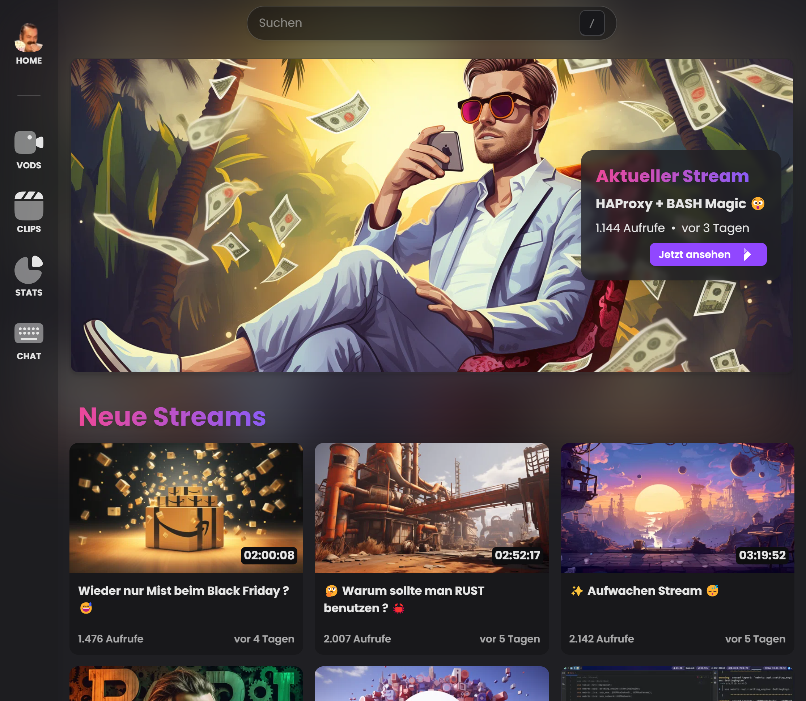
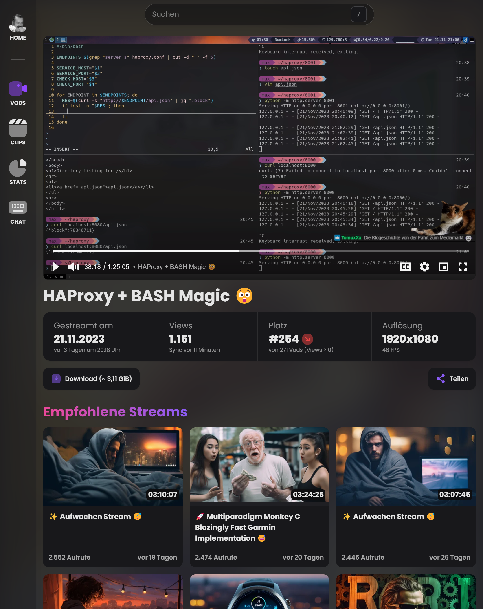
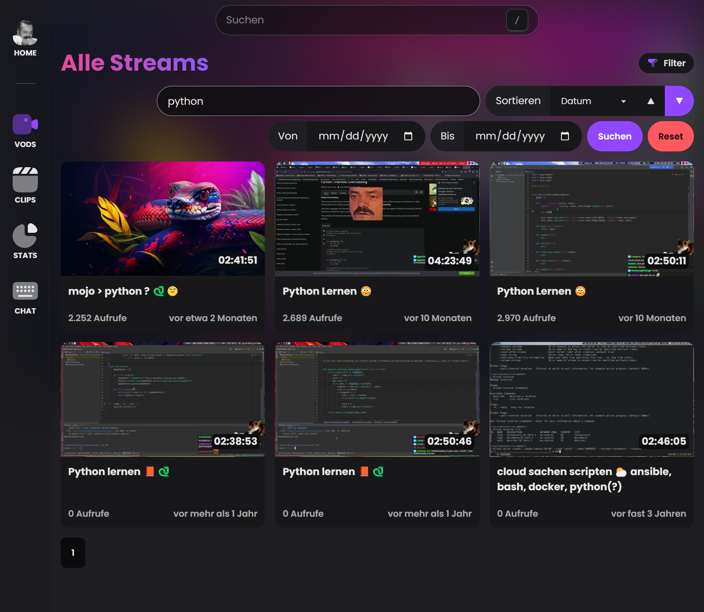
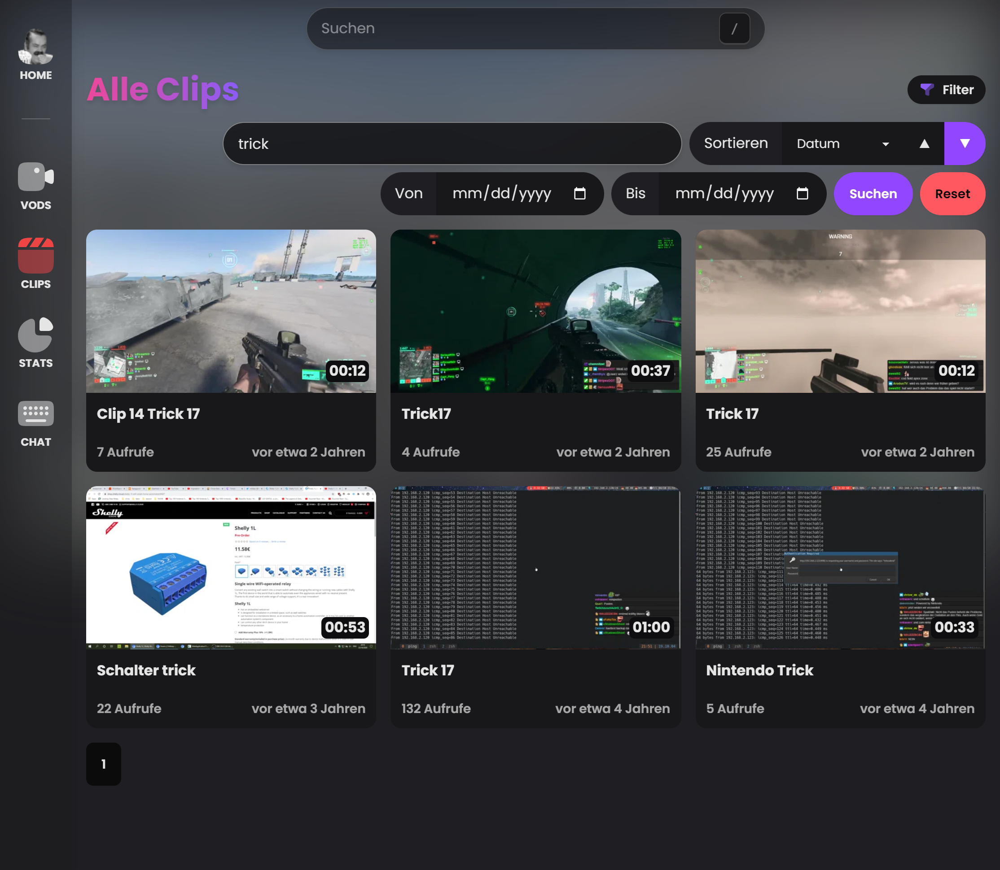
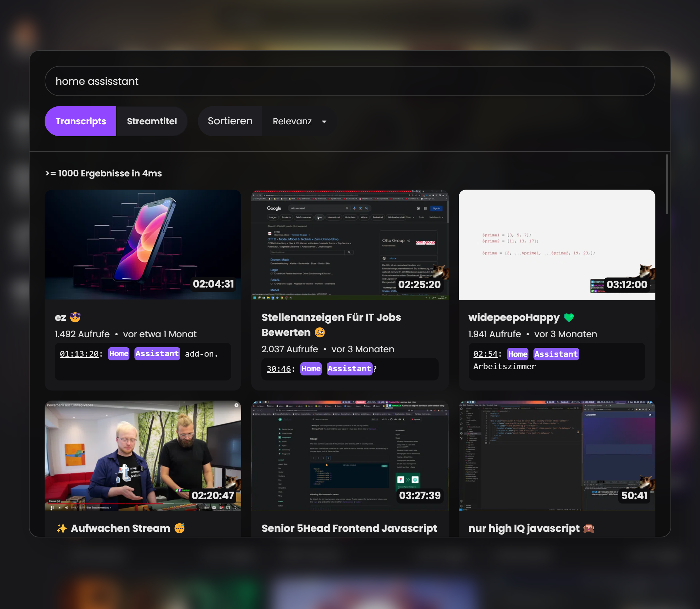
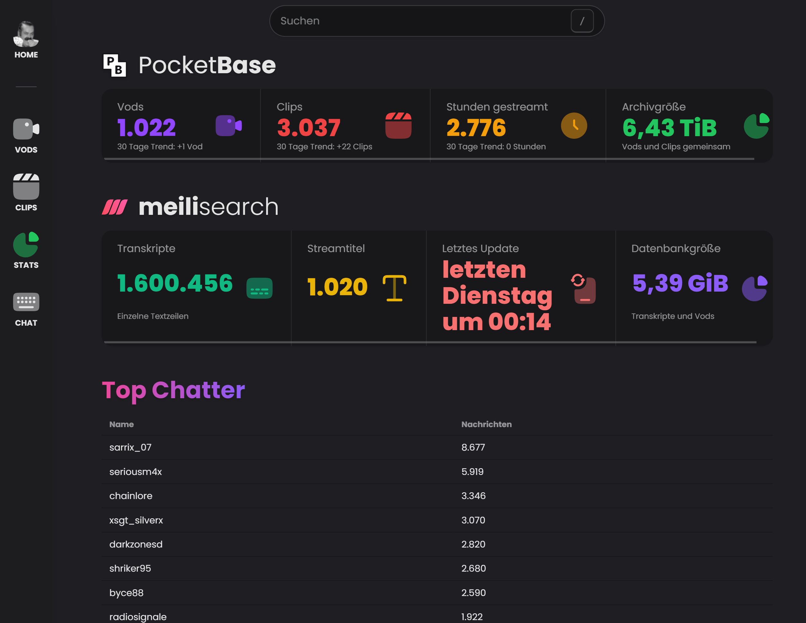
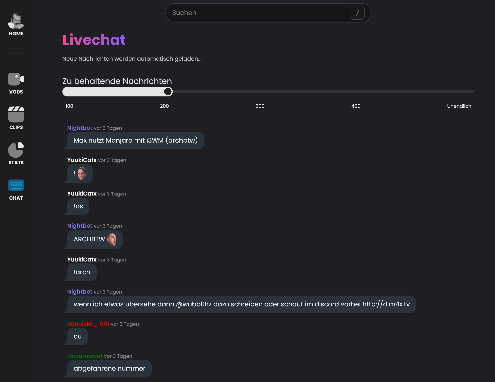

<div align="center" width="100%">
    
</div>

<div align="center" width="100%">
    <h2>wubbl0rz VOD Archiv</h2>
    <p>Backend Stack: Go, PocketBase, Echo, FFmpeg, discordgo</p>
    <p>Frontend Stack: SvelteKit, Tailwind (DaisyUI), VidStack, PNPM</p>
</div>

## 🤩 Features

-   👉 Automatically **downloads vods and clips**
-   👉 Automatically **creates all assets** like thumbnails, preview videos and sprite thumbnails for player hover
-   👉 **Full text search** of every spoken word powered by [whisper and meilisearch](https://github.com/seriousm4x/wubbl0rz-archiv-transcribe)
-   👉 **Filter and sorting** for vods and clips
-   👉 **Chatlogger with auto update** as new messages come in
-   👉 Set **custom thumbnails** by uploading them to the api backend
-   👉 Admin backend to **upload vods to YouTube**
-   👉 **Free to use api** using [PocketBase](https://pocketbase.io/)
-   👉 **Statistics page** to see PocketBase and meilisearch stats as well as top chatters and emotes
-   👉 **Discord bot** to automatically post stream live notifications and slash commands

## 📷 Screenshots

<details open>
    <summary>click to close</summary>










</details>

## 🐳 Deploy

-   Copy the `SAMPLE.env` to `.env` and fill in the strings
-   `docker-compose up`

## 🔧 Developing

-   Copy the `SAMPLE.env` to `.env` and fill in the strings
-   `source .env`

Frontend:

```bash
cd frontend
pnpm i
pnpm run dev --host
```

Backend:

```bash
cd backend
go get ./cmd/archiv-wubbl0rz
go run ./cmd/archiv-wubbl0rz serve --http 0.0.0.0:8090
```

## 🚪 Reverse Proxy

The easiest way is to use caddy. Paste the following into a file called `Caddyfile`.

```
wubbl0rz.tv {
    reverse_proxy localhost:3000
    header Cache-Control "max-age=31536000"
    header Access-Control-Allow-Origin *
    header Access-Control-Allow-Credentials true
    header Access-Control-Allow-Methods *
    header Access-Control-Allow-Headers *
}
api.wubbl0rz.tv {
    reverse_proxy localhost:8090
    encode zstd gzip
    root / /path/to/archiv/media
    @not {
        not path /vods /clips
    }
    reverse_proxy @not localhost:8090
}
meili.wubbl0rz.tv {
    reverse_proxy localhost:7700
}
```

## 🔎 Meilisearch

Meilisearch index is filled with [wubbl0rz-archiv-transcribe](https://github.com/seriousm4x/wubbl0rz-archiv-transcribe).

A custom config is required for our indexes. [Use the api](https://docs.meilisearch.com/reference/api/settings.html#update-settings) to patch the index settings like so:

> PATCH `http://localhost:7700/indexes/transcripts/settings/`

```json
{
    "displayedAttributes": ["*"],
    "searchableAttributes": ["text"],
    "filterableAttributes": [],
    "sortableAttributes": ["date", "duration", "viewcount"],
    "rankingRules": [
        "sort",
        "words",
        "typo",
        "proximity",
        "attribute",
        "exactness"
    ]
}
```

> PATCH `http://localhost:7700/indexes/vods/settings/`

```json
{
    "displayedAttributes": ["*"],
    "searchableAttributes": ["title"],
    "filterableAttributes": [],
    "sortableAttributes": ["date", "duration", "viewcount"],
    "rankingRules": [
        "sort",
        "words",
        "typo",
        "proximity",
        "attribute",
        "exactness"
    ]
}
```

> PATCH `http://localhost:7700/indexes/transcripts`

```json
{
    "primaryKey": "meili_id"
}
```
